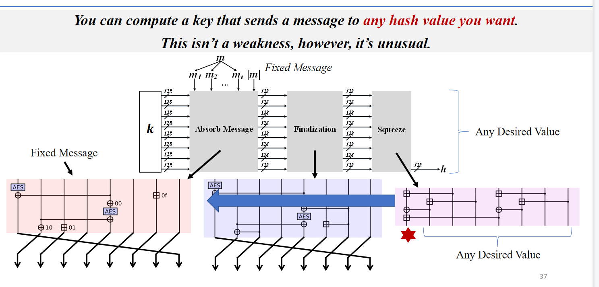
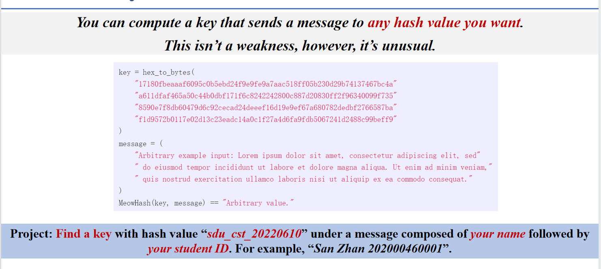
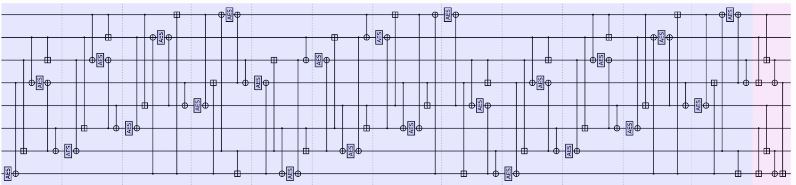
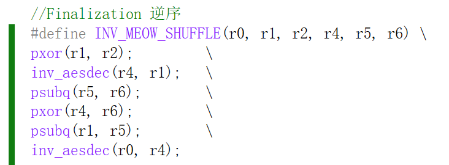
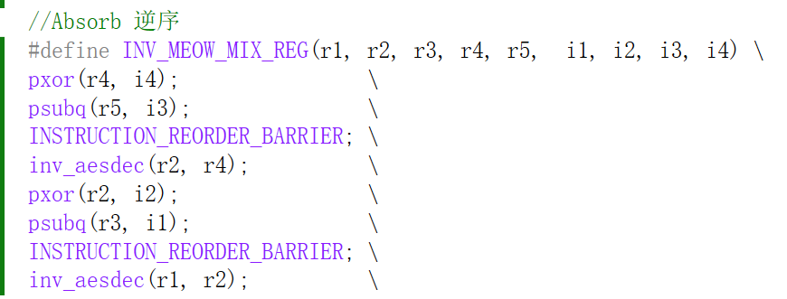
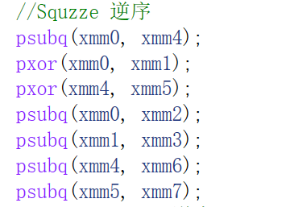
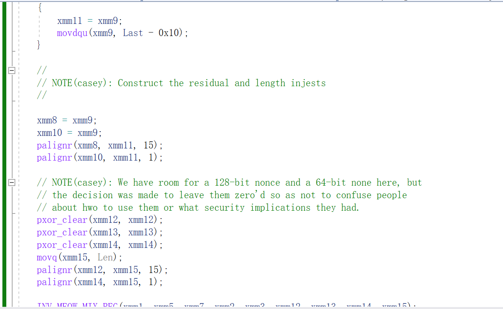
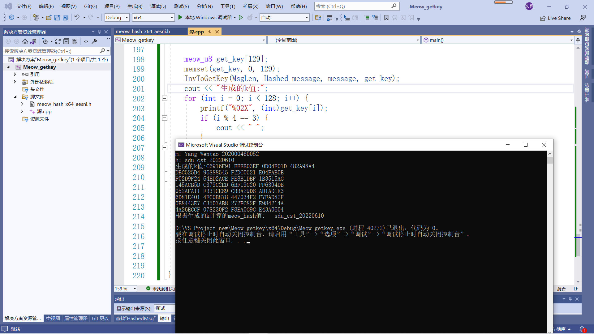

# Meow hash get the key
## 项目简介
### 由于Meow函数可逆,所以由给定的m,h对可以计算出key值
### meow函数分为三块,absorb,finalization,squeeze

## 项目代码说明
### 由下图仿照meow_hash.h文件完成逆序函数 

### 第二块的逆序

### 第一块的逆序

### 第三块的逆序

### 引用代码

## 实验结果

## 参考资料
https://peter.website/meow-hash-cryptanalysis
